## Udacity - Data Engineering Nanodegree

### Capstone Project: Pyspark on Amazon EMR with Apache Airflow 2.1

#### Table of contents

* [Project Description](#project-description)   
* [Files in Repository](#files-in-repository)
    *   [Datasets](#datasets)  
    *   [Other files in repository](#other-files-in-repository)  
* [Simplified Architecture Diagram](#architecture-diagram)
* [Setup](#setup)
    *   [1. Create S3 bucket](#create-s3-bucket)
    *   [2. Set up access keys credentials on AWS IAM](#aws_iam_access_keys)
        *   [2. 1. Set up AWS access keys credentials on AWS IAM](#aws_iam_access_keys)  
        *   [2. 2. Create an EC2 login Key Pairs on AWS EC2](#ec2_keypairs)
    *   [3. Programs and packages required](#programs_required)  
        *   [3. 1. Setting up Apache Airflow to run locally with Windows Subsystem for Linux (WSL)](#wsl_airflow_setup)  
        *   [3. 2. SSH into EMR cluster master node to access log files and debugging](#ssh)   
* [Data Assessment and Data Cleaning](#data_cleaning)  
    *   [1. I-94 US International Visitor Arrival in 2016](#i94_us_immi)
    *   [2. Airport Codes](#airport)  
    *   [3. Demographics data of US cities in 2015](#us_demo)  
    *   [4. Global Land Temperatures by Cities from 1743 to 2013](#globalTemp)  
    *   [5. US Port Codes](#us_port)  
    *   [6. US State Boundaries](#us_state_boundaries)
    *   [7. ISO 3166-1 Country Codes](#iso3166)
    *   [8. ISO 3166-1 Country Codes and Coordinates](#iso3166_ccc)
    *   [9. ISO 3166-3 Formerly Used Country Names and New Country Names](#iso3166_3_former_countries)
* [Data Model](#data_model)
* [ETL Pipelines](#etl)
* [Discussions](#discussions)
* [Data Analytics and Visualisations](#datavis-analytics)

#### Project Description
In the last two Udacity's Data Engineering Nano Degree projects, we leveraged Spark on AWS EMR cluster to build ETL pipeline for a data lake hosted on AWS S3, and Apache Airflow to automate and monitor data ETL pipelines. In this capstone project, we will combine those two concepts to schedule a Spark job to build ETL data pipeline with Apache Airflow and migrate on-premise SAS database storage files to cloud-based data lake on AWS S3. The datasets used in this project are the 2016 I-94 US international visitor arrival records, provided by Udacity.  

Airflow schedules the upload of SAS database storage files, other supporting data files and Python scripts from local machine to an existing S3 bucket, spins up EMR cluster, and performs data transformation as well as data quality checks on the transformed datasets in parquet files loaded from HDFS onto the S3 bucket before terminating the EMR cluster.

The transformed datasets can then be queried to get insights on the visitors to United States in 2016, such as which season or month had the highest number of visitors, and which US state attracted the most visitor from a certain country.

#### Files in Repository

The tree view of the airflow home folder structure is shown below:  
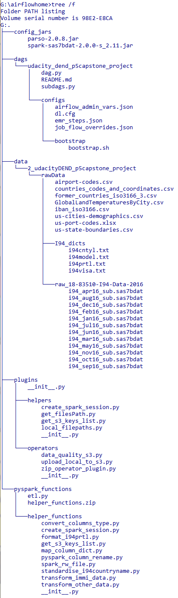

##### Datasets
The datasets used in this project are contained in `rawData` folder which includes the following subfolders and files:

| Subfolder / File Name |  Data Source | Description |
| --------------------- |  ----------- | ----------- |
| raw_18-83510-I94-Data-2016 | [US National Tourism and Trade Office](https://www.trade.gov/i-94-arrivals-program) | Dataset from I-94 visitor arrivals program that shows US international visitor arrival record in 2016. The SAS database storage files are in .sas7bdat format. |
| I94_dicts                  |  [US National Tourism and Trade Office](https://www.trade.gov/i-94-arrivals-program) | Subfolder contains multiple text files with list of codes obtained from `I94_SAS_Labels_Descriptions.SAS`. Each text file contains label descriptions for the column values in US Immigration dataset. Details of each text files and its associated column are shown in the [Data Cleaning section](#i94_dicts_table). |
| airport-codes.csv | [DataHub.io](https://datahub.io/core/airport-codes#data) | Airport codes from around the world. |
| us-cities-demographics.csv | [opendatasoft](https://public.opendatasoft.com/explore/dataset/us-cities-demographics/export/) | Demographics data of US cities in 2015, which originated from US Census Bureau's 2015 American Community Survey. |
| GlobalLandTemperaturesByCity.csv | [Kaggle](https://www.kaggle.com/berkeleyearth/climate-change-earth-surface-temperature-data) | Global land temperature by city from 1743 up to 2013. |
| us-port-codes.xlsx | [LOCODE](https://locode.info/US) | Codes for trade and transport locations in United States. This additional dataset comes from [UNECE](https://unece.org/trade/uncefact/unlocode) and will be used along with `airport-codes.csv` to improve port of entry label description for column i94port that have 'No PORT Code' or 'Collapsed' strings. |
| us-state-boundaries.csv | [opensoftdata](https://public.opendatasoft.com/explore/dataset/us-state-boundaries/export/) | Additional dataset containing state codes and coordinates of all states and territory (including Saipan in Northern Mariana Islands (MP)) in United States. This dataset also contains geometry data for each US states, and it can be used for the purpose of spatial data visualisation and analysis. |
| iban_iso3166.csv | [IBAN.com](https://www.iban.com/country-codes) | This additional dataset contains a complete list of all country's Alpha-2, Alpha-3 ISO codes and M49 numeric code as described in ISO 3166 international standard. This dataset will be joined with countries_codes_and_coordinates.csv to provide a country names reference list for mapping each number label in i94cntyl to ISO standard country names as well as country codes. |
| countries_code_and_coordinates.csv | [Tadas Tamošauskas' GitHub repository](https://gist.github.com/tadast/8827699) | This additional dataset contains list of countries with its ISO 3166-1 Alpha-2, Alpha-3 and M49 numeric codes as well as average latitude and longitude coordinates. |
| former_countries_iso3166_3.csv | [Wikipedia](https://en.wikipedia.org/wiki/ISO_3166-3) | This additional dataset is part three of the ISO 3166 standard that defines codes for formerly used names for countries and have been deleted from ISO 3166-1. This will be used to look up new country names for each of the formerly used country names in i94cntyl. |  

##### Other files in repository

In the `airflow_home` folder, apart from the `data` subfolder containing datasets, there are four other subfolders:
* `config_jars` holds parso-2.0.8 and spark-sas7bdat-2.0.0-s_2.11 jar packages required to read sas7bdat files.  

* `dags` folder that contains project subfolders and its contents:
    - `configs` subfolder:  
         -  `bootstrap` subfolder that houses the bootstrap shell script for AWS EMR cluster creation.
         -  `airflow_admin_vars.json` contains key-value pairs of Airflow variables.
         -  `dl.cfg` contains AWS access keys.
         -  `emr_steps.json` contains list of EMR steps.
         -  `job_flow_overrides.json` contains dictionary of JobFlow overrides that will be passed to override the config from EMR connection.
    - `dag.py` instantiates a DAG object, configures operators and sets task dependencies.
    - `subdags.py` contains functions to generate a DAG to be used as a subDAG that runs UploadLocalToS3Operator on all files in `rawData` folder.
    - `README.md` provides introduction and discussion on this capstone project.

* `plugins` folder that holds subfolders and an `__init__` file:
    - `helpers` subfolder contains:
        - `__init__.py` contains setup to import functions in `helpers` subfolder.
        - `create_spark_session.py` contains function to start a Spark session and load config jar package of spark-sas7bdat.
        - `get_filesPath.py` contains function to scan a directory and return dictionary of files that is not .pyc as key and file full path as its value.
        - `get_s3_keys_list.py` contains function to obtain list of keys in a S3 bucket with access point options either from local machine or EC2 instance.
        - `local_filepaths.py` contains LocalFilepaths class that bundles directories of files in local machine and its corresponding S3 key name to upload to.
    - `operators` subfolder contains:
        - `__init__.py` contains setup to import operators.
        - `upload_local_to_s3.py` contains operator to upload files from local machine to an existing S3 bucket.
        - `zip_operator_plugin.py` contains operator to zip folder in local machine. This Airflow plugin was downloaded from [Robert Sanders' GitHub repository](https://github.com/rssanders3/airflow-zip-operator-plugin/blob/master/zip_operator_plugin.py)  
        - `data_quality_s3.py` contains operator that performs row count and null value checks against transformed datasets loaded onto S3 bucket.
    - `__init__.py` defines plugin class for operators and helper scripts.

* `pyspark_functions` contains functions for datasets transformation that will be uploaded to S3 bucket and passed onto spark-submit command in EMR step.
    - `etl.py` contains ETL pipeline where datasets are read from HDFS, transformed and loaded onto S3 bucket.
    - `helper_functions` subfolder contains functions to be imported to `etl.py` to run data processing on Spark.
        - `__init__.py` contains blank file to indicate this folder should be regarded as a python package.
        - `convert_columns_type.py` contains function to convert data type of multiple columns to a specified data type in a Spark dataframe.
        - `create_spark_session.py` contains function to start a Spark session and load config jar package of spark-sas7bdat.
        - `format_i94prtl.py` contains function that formats port location label in `i94prtl.txt` and matches invalid port codes to airport and us-port-codes datasets to get a possible port location using fuzzywuzzy Python package.
        - `get_s3_keys_list.py` contains function to obtain list of keys in a S3 bucket.
        - `map_column_dict.py` contains function that maps labels in the existing column in Spark dataframe according to their values in dictionary to a new column.
        - `pyspark_column_rename` contains function that removes special characters [" ,;{}(\n\t=)"] in Spark DataFrame column names before writing DataFrame to parquet file
        - `spark_rw_file.py` contains function to read file in either csv, xlsx, sas7bdat or txt format to a Spark dataframe and write dataframe to parquet file format in a speficied directory.
        - `standardise_i94countryname.py` contains function that formats the country name label in `i94cntyl.txt`, checks whether the country name is in former  country ISO3166-3 (former_countries_dict), and finally finds a matching ISO 3166-1 country name in a country name reference list using fuzzywuzzy Python package.
        - `transform_immi_data.py` contains functions to transform US Immigration dataset which to be run after completing transformation of other datasets.
        - `transform_other_data.py` contains functions to transform all datasets in `rawData` folder other than US Immigration datasets.
    - `helper_functions.zip` is a zipped `helper_functions` folder from running ZipOperator plugin in Airflow.

#### Architecture Diagram

The size of each monthly SAS database storage files and `GlobalLandTemperaturesByCity.csv` file is approximately 500MB. The processing of these large and growing datasets requires a high performance analytics engine that is faster than Python Pandas that runs on a single machine. In this project, Pyspark, a Python interface for Apache Spark, is used for the ETL pipeline because of its capability of parallel processing on the distributed cluster as well as processing on a single node.  Running Pyspark on AWS EMR allows easy cluster up-scaling as the size of the datasets increases.

The datasets are converted and written into parquet file as it is a columnar format that supports efficient compression hence it has higher execution speed and consumes less disk space than other file formats.  Another advantage of parquet is it preserves the schema of the dataframe.  

Automating the ETL process of the large and growing datasets minimises human error and produces a consistent and reliable output. Automating the data pipeline using Apache Airflow will also allow the monitoring of data ETL pipeline.

Lastly, AWS S3 will be used to store the transformed data because of integration with AWS EMR, the ease of managing control access as well as its low cost.   

The simplified architecture diagram used in this project is shown below:  
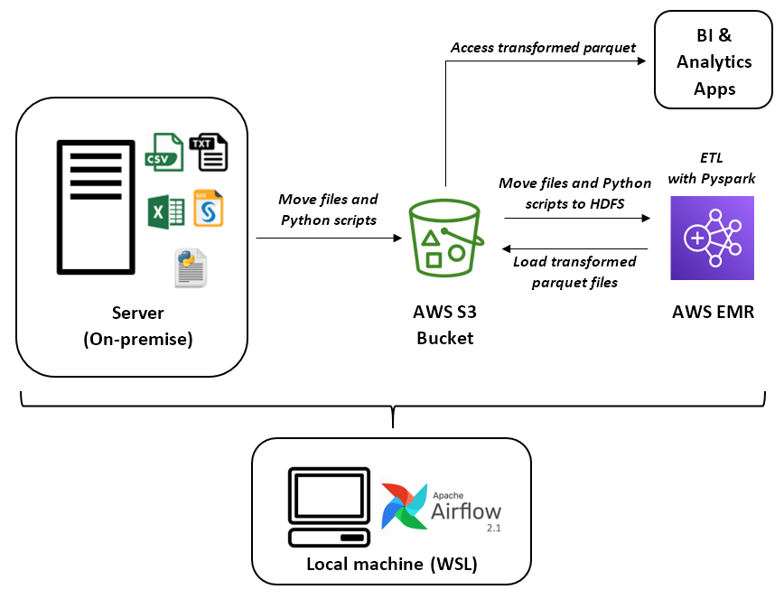

#### Setup

##### 1. Create S3 bucket

Create an S3 bucket to upload the data and Python scripts to as follows:  
1. On S3 service in AWS Management Console, create a new S3 bucket with _bucket name_ `udacity-dend-capstone-project`.  
2. Select _AWS Region_ of `US West (Oregon) us-west-2` from the drop-down list.  
3. Untick `Block all public access` box, and tick the box under it to acknowledge all public access to this S3 bucket and its objects. _Note that public access to S3 bucket is granted in this project for simplicity. In real practice, access to S3 bucket should not be public, and the read/write permission to other AWS accounts is managed in Access Control List (ACL) under Permissions tab of the S3 bucket created._

##### 2. Set up AWS access keys credentials and EC2 Key Pairs

###### 2.1. Set up AWS access keys credentials on AWS IAM  
As a best practice, create and use a temporary security credentials (IAM User) instead of using root user access keys which has unrestricted access to all the resources in your account. The steps to set up access keys on AWS IAM are as follows:  
1. Create an IAM user on AWS IAM.  
2. Specify user name, and access type as _Programmatic access_ only.  
3. Set the permissions to the new user by attaching _AdministratorAccess_ policy from the list and click Next.  
4. Review the details of the new user and create the new user.  
5. Download the access key in .csv file containing the _Access Key ID_ and a _Secret Access Key_.  
6. Copy and paste access keys into `dl.cfg` file.

###### 2.2. Create an EC2 Login Key-Pair on AWS EC2
EC2 key pairs is required to SSH into EMR in order to get the logging file for each EMR steps or locate files moved from S3 to HDFS. The steps to create an EC2 key pairs are as follows:
1.  On AWS EC2 page, navigate to `Key Pairs` under `Network & Security`.
2.  Click on `Create key pair` button.
3.  Enter key pair `name` and select file format of `ppk`. In this project, the key pair name has been set to `ud-dend-p5-capstone-kp1`.
4.  Click on `Create key pair` button.  
5.  Save the automated downloaded PuTTY private key file in a directory for when SSH-ing into EMR.    

##### 3. Programs and packages required  

The list of installed programs and packages on a Windows 10 64-bit operating system for this project is shown in table below.  

| No. | Programs & packages | Version |  Installation instruction reference |
| :-- | :------------- | :------------- | :----------------------------------|
| 1.  | Ubuntu | 20.04.2 LTS | [John Nicholson's GitHub](https://github.com/nicholsonjohnc/spark-wsl-install) |
| 2.  | Java | java-8-openjdk-amd64 | Refer to No.1 reference |
| 3.  | Hadoop | 2.7.3 | [Raymond's article on Kontext](https://kontext.tech/column/hadoop/307/install-hadoop-320-on-windows-10-using-windows-subsystem-for-linux-wsl).  The binary is downloaded from [Apache hadoop archive](https://archive.apache.org/dist/hadoop/common/hadoop-2.7.3/hadoop-2.7.3.tar.gz). |
| 4.  | Spark | spark-2.4.8-bin-hadoop2.7 | Refer to No.1 reference |
| 5.  | Anaconda | Anaconda3-5.2.0-Linux-x86_64.sh | [Emily Kauffman's GitHub](https://gist.github.com/kauffmanes/5e74916617f9993bc3479f401dfec7da) |  
| 6.  | Python3  | 3.7.10 | [Linuxize article](https://linuxize.com/post/how-to-install-python-3-7-on-ubuntu-18-04/).   Register both Python 3.7 and Python 3.8, then choose Python 3.7 as default python3 by following Steps 3 and 4 in [Kumar Chandresh's GitHub](https://gist.github.com/chandr3sh/8e63613689312dd6882b1d5791742db5). |
| 7.  | Pyspark | 2.4.8 | `pip install --user pyspark==2.4.8` |
| 8.  | Apache Airflow | 2.1.0 | [Philipp Schmalen's article](https://towardsdatascience.com/run-apache-airflow-on-windows-10-without-docker-3c5754bb98b4) |
| 9.  | boto3 | 1.17.100 | `pip install boto3==1.17`
| 10. | apache-airflow-providers-amazon | 2.0.0 | `pip install apache-airflow-providers-amazon`|

##### 3.1.  Setting up Apache Airflow to run locally with Windows Subsystem for Linux (WSL)
Apache Airflow was installed and run locally with WSL by following the step-by-step instructions in [Philipp Schmalen's article](https://towardsdatascience.com/run-apache-airflow-on-windows-10-without-docker-3c5754bb98b4).  

To run Airflow on Windows machine, the procedure is as follows:  
1. Open two Command Prompts and get to WSL shell on both cmd by entering:  
    `wsl`  

2. Navigate to dags folder in airflow home directory that has been defined during installation step on both cmd's. In this project, airflow home is set on G:/airflow_home, hence the command is:  
    `cd ../../../g/airflowhome/dags/udacity_dend_p5capstone_project`

3. In one of the cmd terminal, initialise database in airflow home directory by typing:  
    `airflow db init`

    When running Airflow on local machine for the first time, it is required to create an account and specify a password prior to login. This can be done as the following:  
    `airflow users create --username yourusername --firstname yourfirstname --lastname yourlastname --role Admin --email youremail@domain.com`

4. In the same cmd terminal, initialise airflow scheduler:  
    `airflow scheduler`

5. In the other cmd terminal, start webserver and leave the port to default port 8080 with the following command:  
    `airflow webserver`

6. Open the airflow webserver by visiting `http://localhost:8080` in the browser and login using the admin account created.

7. On Airflow UI, create connection to Amazon Web Services by navigating to `Admin` tab >> `Connections` and enter the following values:
    - **Conn Id**: `aws_credentials`  
    - **Conn Type**: `Amazon Web Services`  
    - **Login**: Enter _Access key ID_ in the CSV file obtained from _[Step B.1](#aws_iam_access_keys)_.  
    - **Password**: Enter _Secret access key_ in the CSV file obtained from _[Step B.1](#aws_iam_access_keys)_.  
    - **Extra**: `{"region_name" : "us-west-2"}`

    Once the values have been entered, select `Save` button.

8. On Airflow UI, import `airflow_admin_vars.json` by selecting the json file and `Import Variables` button. Once imported successfully, the following key-value pairs will appear on the page:  
    | Variables           | Key                 | Val                                    |
    | :------------------ | :------------------ |:-------------------------------------- |
    | S3 bucket           | `s3_bucket`         | `udacity-dend-capstone-project`        |
    | EMR log in S3       | `s3_log_bucket`     | `udacity-emr-log-bucket`               |
    | EMR EC2 key pair    | `emr_ec2_key_pair`  | `ud-dend-p5-capstone-kp1`              |

9. On the DAG tree view page, check whether all the tasks are shown correctly.  
10. Once ready to trigger DAG, click on the `Pause/Unpause DAG` slide button on the top left of the UI, and click the Play button then select `Trigger DAG`.
11. On Airflow 2.0+, there is a bug that DAG will switch to `queued` status when it gets to a subDAG. When running Airflow for this project, it will get stuck at subDAG `UploadLocalToS3Operator`. To continue running the subDAG, stop the airflow scheduler on first Command Prompt window by selecting Ctrl+C on your keyboard. Then run the scheduler again, by typing `airflow scheduler` in the command prompt. The subDAG should continue to run after selecting `Update` on the Airflow UI.      

##### 3. 2. SSH into EMR cluster master node to access log files and debugging  

The procedure to get tree view of the files that have been uploaded onto HDFS in one of the Spark steps is as follows:  
  -  Change setting in Security Group for master:
        -  After the EMR cluster is successfully launched, navigate to EMR cluster Summary tab.  
        -  Click on link of **Security Group for Master** under _Security and access_.  
        -  Select Security group ID which name is ElasticMapReduce-master.  
        -  Click on `Inbound rules` tab, then on `Edit Inbound rules`.  
        -  Click `Add rule` button. Select _SSH_ in `Type` and _My IP_ in `Source type`.  
        -  Click `Save rules`.

  -  SSH into EMR cluster master node:  
        -  Launch PuTTY program on your desktop.  
        -  Navigate to _Session_ in _Category_ list.  
        -  On the newly created EMR cluster page, copy the Master public DNS. In Host Name box, type `hadoop@MasterPublicDNS`, swap `MasterPublicDNS` with the copied Master public DNS.
        -  Next, navigate to _SSH_ > _Auth_ on the _Category_ list.
        -  For _Private key file for authentication_, click on `Browse` button and select the `.ppk` file generated in _[Step 2.2](#ec2_keypairs)_.  
        -  Select _Open_ and then _Yes_ to dismiss the PuTTy security alert.  
        -  To get the view of files that have been uploaded onto HDFS, run the following command on the master node:  
            `[hadoop@ip-xxx-xx-xx-xxx ~]$ hadoop fs -ls hdfs:///home/hadoop/udacity-dend-capstone-project/`  
        -  To read the log file of one of the Spark ETL steps:  
              - Navigate to `Steps` tab in EMR.  
              - Copy the ID of the EMR step which log file you would like to access to.  
              - Run the following commands in PuTTY:  
                  `cd ~/../../mnt/var/log/hadoop/steps/<EMR step ID copied>`  
                  `cat stdout`  
              - Alternatively, the log file of each EMR steps will be available from the `View logs` link on `Steps` tab in EMR, a few minutes after step completed or failed, as shown below.   
        -  When you are done working on the master node, the SSH connection can be ended by closing PuTTY.

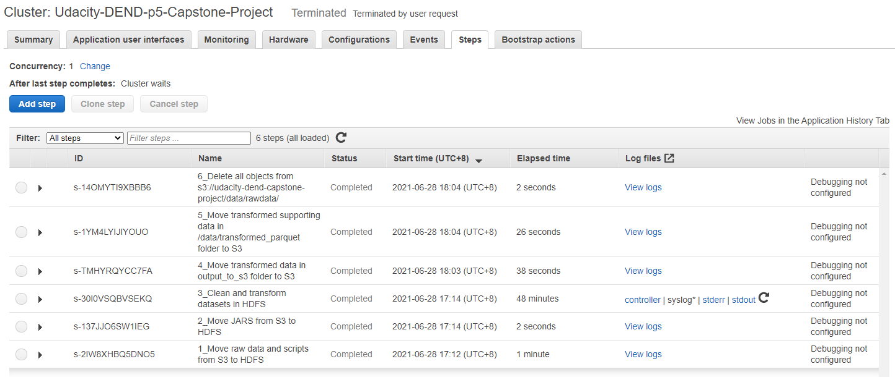

#### Data Assessment and Data Cleaning

In this section, we will go through each datasets and discuss the data cleaning process. The flow diagram of the overall ETL process for this project can be found in [Data Model section](#ETL_flow_diagram).  

##### __1. I-94 US International Visitor Arrival in 2016__       

  The preview and the column details of the dataset are shown below.

  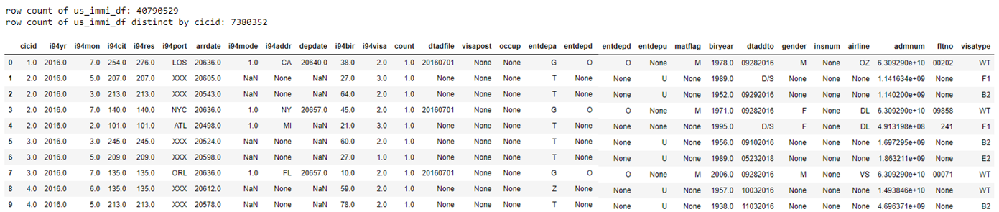

  | No | Column name | Data type  | Missing values count | Column description  |
  | :- | :---------- | :--------- | :------------------ | :------------------- |
  | 1. | cicid       |  double    | 0 | CIC id that is only unique in a monthly dataset. Together with i94yr and i94mon, they make a composite unique key. |
  | 2. | i94yr       |  double    | 0 |arrival year, in 4 digit numerical format   |
  | 3. | i94mon      |  double    | 0 | arrival month, in numerical format  |
  | 4. | i94cit      |  double    | 28575 | country of citizenship. Values need to be mapped to dictionary `i94cntyl` to obtain associated country name. |
  | 5. | i94res      |  double    | 0 | country of residence. Values need to be mapped to dictionary `i94cntyl` to obtain associated country name. |
  | 6. | i94port     |  string    | 0 | US port of entry, in three-alphanumeric-code format. `i94prtl` dictionary is used for mapping code to port details and state location. Some codes in dictionary is invalid with string patterns 'INVALID:%', 'Collapsed % (should not show)', and 'No Country Code %'. |
  | 7. | arrdate     | double     | 0 | arrival date in US, in SAS date numeric format. Number in column represents number of days since 1st January 1960.|
  | 8. | i94mode     | double     | 73949 | mode of transport, either by air (1), sea (2), land (3) or not reported (9). Some missing values found.  Dictionary `i94model` for mapping label to mode of transport |
  | 9. | i94addr     | string     | 2027926 | first intended address (state) while in US. All other code that is invalid is listed under '99'.|
  | 10.| depdate     | double     | 3308012 | departure date from US, in SAS date numeric format. Number in this column represents number of days since 1st January 1960.|
  |11. | i94bir      | double     | 9517 | age of visitor in years at time of arrival to US.  |
  |12. | i94visa     | double     | 0 | visa code that falls into three categories: business (1), pleasure (2), student (3).  |
  |13. | count       | double     | 0 | column with values of 1, used for statistical summary.  |
  |14. | dtadfile    | string     | 131050 | date added to I-94 files. Character date field in yyyyMMdd string format.  |
  |15. | visapost    | string     | 24032175 | State Department where visa was issued.  |
  |16. | occup       | string     | 40597574 | occupation that will be performed in US. Lots of empty rows. |
  |17. | entdepa     | string     | 2404 | arrival flag - admitted or paroled into US. |
  |18. | entdepd     | string     | 3287909 | departure flag - departed, lost I-94 or is deceased. |
  |19. | entdepu     | string     | 40777323 | update flag - apprehended, overstayed, adjusted to permanent residence. |
  |20. | matflag     | string     | 3219581 | match flag - match of arrival and departure records. |
  |21. | biryear     | string     | 9517 | year of birth in yyyy format.  |
  |22. | dtaddto     | string     | 101551 | date of visa expiry. Character date field in yyyyMMdd string format.  |
  |23. | gender      | string     | 4079983 | gender, in M, F or X. There is some rows with missing values. |
  |24. | insnum      | string     | 35678095 | Immigration and Naturalization Service (INS) number. |
  |25. | airline     | string     | 1308066 | code of air carrier boarded to arrive in US. |
  |26. | admnum      | double     | 0 | admission number   |
  |27. | fltno       | string     | 333922 | flight number on arrival |
  |28. | visatype    | string     | 0 | class of admission legally admitting the non-immigrant to temporarily stay in US |

  __Data cleaning process for I-94 US international arrival dataset__  

  Label mapping for columns `i94addr`, `i94cit`, `i94res`, `i94port`, `i94mode` and `i94visa` using dictionaries listed in the table below.

   

   | Column(s)       | Dictionary for label mapping |  
   | -------------   | ---------------------------- |
   |  i94cit, i94res | i94cntyl      |
   |  i94mode        | i94model      |
   |  i94port        | i94prtl       |
   |  i94visa        | i94visa       |
   |  i94addr        | US state boundaries dataset |

  Except for dictionaries `i94mode` and `i94visa` that will be used for mapping as it is,  other dictionaries will be processed prior to label mapping:  
  * `i94cntyl`:  The country names in dictionary `i94cntyl` are in capital letters. The country name will be formatted with initial capitals (ie. capitalise first letter of all words). The country name will also be standardised using the list of country name in world cities dataset as reference.
  * `i94prtl`: The port location names are also in capital letters. The port location name will be formatted while its state code to be kept as it is. There are some labels with incomprehensive descriptions such as 'No PORT Code' and 'Collapsed'. These labels will be looked up in either `gps_code` and `iata_code` columns in airport codes dataset or us_port_city_code column in US port codes dataset, depending on the transportation mode, and have the label description replaced according to the matching code.  
  * `i94addrl`: The dictionary `i94addrl` will not be used in this project. The US state code in column `i94addr` will be mapped using US state boundaries dataset instead as it provides a more comprehensive list of US states that includes US territories of American Samoa (AS) and Northern Mariana Islands (MP).

  The data transformation steps are as follows:  
   - Remove duplicate rows and drop columns that will not be used in analysis.
   - Convert the SAS date in numeric format in columns `arrdate` and `depdate` to yyyy-MM-dd date format. The null value in `depdate` column is imputed with '0' before the date conversion.
   - Cast columns `cicid`, `i94yr`, `i94mon`, `biryear`,  `i94res` and `i94cit` to integer type.  
   - Extract `i94model.txt` and convert it to a Python dictionary.   
   - Extract `i94visa.txt` and convert it to a Python dictionary.  
   - Map labels in columns `i94mode` and `i94visa` into new columns `transport_mode` and `visa_category`, respectively, according to its corresponding dictionary.
   - Rename other column names, as follows:  

       | Original column names | New column names |  
       | -------------------   | ---------------- |
       | i94yr | year |
       | i94mon | month |
       | biryear | birth_year |
       | i94res | residence_country |
       | i94cit | citizenship_country |
       | i94port | port_of_entry |
       | flt_no | flight_no |
       | i94addr | address_state |

##### __2. Airport Codes__

  The dataset preview, count of missing values and the column details of the airport code dataset are shown below. The column description is taken from data dictionary page of the dataset's original public domain source, [OurAirports.com](https://ourairports.com/help/data-dictionary.html).

  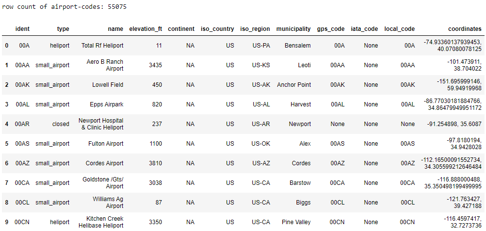

  | No | Column name  | Data type  | Missing values count | Column description  |
  | :- | :----------  | :--------- | :------------------ |  :------------------ |
  | 1. | ident        |  string    | 0 | The text identifier used in the OurAirports URL. This will be the ICAO code if available. Otherwise, it will be a local airport code (if no conflict), or if nothing else is available, an internally-generated code starting with the ISO2 country code, followed by a dash and a four-digit number. |
  | 2. | type         |  string    | 0 | The type of the airport. Allowed values are "closed_airport", "heliport", "large_airport", "medium_airport", "seaplane_base", and "small_airport".   |
  | 3. | name         |  string    | 0 | The official airport name, including "Airport", "Airstrip", etc. |
  | 4. | elevation_ft |  integer   | 7006 | The airport elevation MSL in feet  |
  | 5. | continent    |  string    | 0 | The code for the continent where the airport is (primarily) located. Allowed values are "AF" (Africa), "AN" (Antarctica), "AS" (Asia), "EU" (Europe), "NA" (North America), "OC" (Oceania), or "SA" (South America). |
  | 6. | iso_country  |  string    | 0 | The two-character ISO 3166:1-alpha2 code for the country where the airport is (primarily) located. A handful of unofficial, non-ISO codes are also in use, such as "XK" for Kosovo. |
  | 7. | iso_region   | string     | 0 | An alphanumeric code for the high-level administrative subdivision of a country where the airport is primarily located (e.g. province, governorate), prefixed by the ISO2 country code and a hyphen. OurAirports uses ISO 3166:2 codes whenever possible, preferring higher administrative levels, but also includes some custom codes. |
  | 8. | municipality | string     | 5676 | The primary municipality that the airport serves (when available). Note that this is not necessarily the municipality where the airport is physically located. |
  | 9. | gps_code     | string     | 14045 | The code that an aviation GPS database (such as Jeppesen's or Garmin's) would normally use for the airport. This will always be the ICAO code if one exists. Note that, unlike the ident column, this is not guaranteed to be globally unique. |
  | 10.| iata_code    | string     | 45886 | The three-letter IATA code for the airport (if it has one). |
  |11. | local_code   | string     | 26389 | The local country code for the airport, if different from the gps_code and iata_code fields (used mainly for US airports).  |
  |12. | coordinates  | string     | 0 | The latitude, longitude point of the airport in decimal degrees (positive for north).  |

  __Data cleaning process for airport codes dataset__  
  - Remove duplicate rows.  
  - Remove rows with coordinates of '0, 0'.  
  - Split `coordinates` column into `latitude` and `longitude` columns, and cast them into float data type.  
  - Remove `local_code` and `coordinates` columns.  
  - Rename columns:
    | Original column names | New column names |  
    | -------------------   | ---------------- |
    | iso_country | iso2_country  |
    | iso_region | iso2_region |

##### __3. Demographics data of US cities in 2015__  

  The preview, count of missing values and data type of US City demographics dataset are shown below. The column description has been omitted as the column names of this dataset are self-explanatory.   

  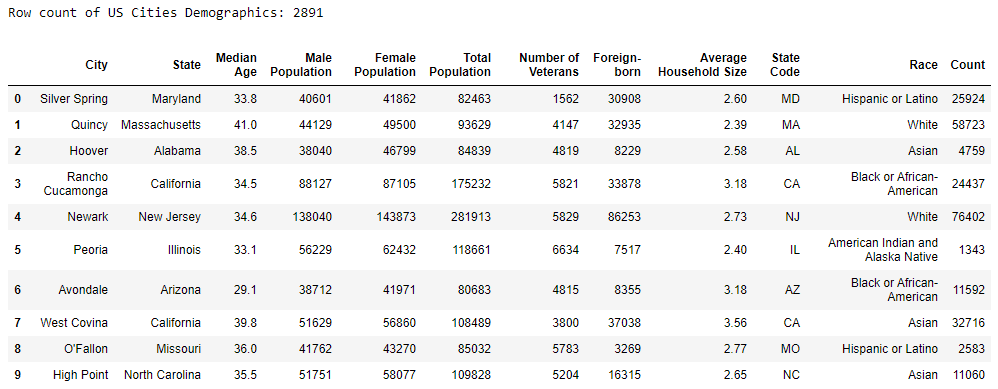

  | No | Column name            | Missing values count | Data type  |
  | :- | :--------------------- | :--------- | :--------- |
  | 1. | City                   |  0  | string    |
  | 2. | State                  |  0  | string    |
  | 3. | Median Age             |  0  | double    |
  | 4. | Male Population        |  3  | integer   |
  | 5. | Female Population      |  3  | integer   |
  | 6. | Total Population       |  0  | integer   |
  | 7. | Number of Veterans     |  13 | integer   |
  | 8. | Foreign-born           |  13 | integer   |
  | 9. | Average Household Size |  16 | double    |
  |10. | State Code             |  0  | string    |
  |11. | Race                   |  0  | string    |
  |12. | Count                  |  0  | integer   |

  __Data cleaning process for US city demographics dataset__  

  - Column names get formatted in `spark_rw_file` function to meet parquet column naming convention.  
  - Remove columns except for `city`, `state_code`, `state`, `male_population`, `female_population`, and `median_age` columns.  
  - Drop rows with null values.  
  - Order dataframe by columns `state` and `city`  

##### __4. Global Land Temperatures by Cities from 1743 to 2013__  

  The dataset preview, count of missing values and the column details of the global temperature dataset are shown below. The column description is taken from [Kaggle](https://www.kaggle.com/berkeleyearth/climate-change-earth-surface-temperature-data).

  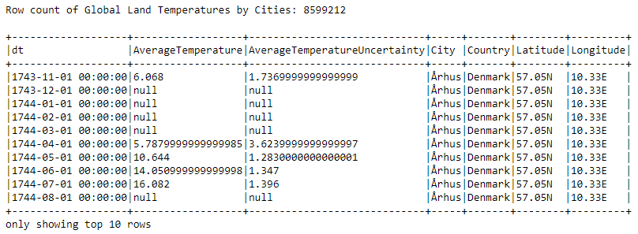

  | No | Column name                    | Missing values count | Data type  | Column description |
  | :- | :----------------------------- | :--------- | :--------- | :------------------- |
  | 1. | dt                             |  0  | timestamp    | Timestamp in yyyy-MM-dd HH:mm:ss format |
  | 2. | AverageTemperature             |  364130  | double    | Global average land temperature in celcius. |
  | 3. | AverageTemperatureUncertainty  |  364130  | double    | The 95% confidence interval of the average temparature |
  | 4. | City                           |  0  | string   | City name |
  | 5. | Country                        |  0  | string   | Country name |
  | 6. | Latitude                       |  0  | string   | Latitude point of the city in two decimal degrees and suffix format |
  | 7. | Longitude                      |  0  | string  | Longitude point of the city in two decimal degrees and suffix format |

  __Data cleaning process for global land temperature by cities dataset__
  - Column names get formatted in `spark_rw_file` function to meet parquet column naming convention.  
  - Remove '00:00:00' in `dt` column, rename column to `date`, cast column to DateType(), and drop `dt` column.  
  - Remove rows with null value in `averagetemperature` column.
  - Drop duplicate rows.
  - Format `latitude` and `longitude` columns by converting points with suffices 'S' and 'W' to negative float type, and suffices 'N' and 'E' to positive float type.
  - Rearrange columns order in the dataframe.
  - Order dataframe by columns `date`, `country`, and  `city`.   
  - Standardise values `country` column using list of country names and dictionary of former country names as reference.  
  - Rename column `country` to `country_iso3166` and drop `country` column.  

##### __5. US Port Codes__  

  The preview of the US port codes are shown below. The dataset will be transformed into two columns, us_port_city_code and us_port_city_state. The first two letters in the code (ie. 'US') that indicates country location will be omitted and only the three-character code for port location will be kept. The transformed dataset is shown in the table on the right hand side. The column description in the table below is adapted from [UNECE](https://unece.org/fileadmin/DAM/cefact/locode/Service/LocodeColumn.htm#Name).  

  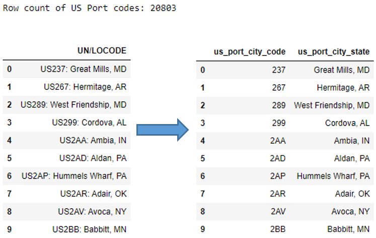

  | No | Column name                    | Missing values count | Data type  | Column description |
  | :- | :----------------------------- | :--------- | :--------- | :------------------- |
  | 1. | us_port_city_code              |  0  | string    | 3-character code for port location |
  | 2. | us_port_city_state             |  0  | string    | Name of the location, followed by US state code. Sample value: Avoca, NY |

  __Data cleaning process for US port codes dataset__  
  - Drop duplicate rows.  

##### __6. US State Boundaries__

  The US state boundaries dataset shown below is a subset of the full US state boundaries dataset. The original dataset consists of columns with land area, water area, geometry and many more. For the purpose of this project, the columns to be used are state code, state name, latitude and longitude points. The coordinates and geometry details of each state will be used in data visualisation. The geometry data will be loaded separately.

  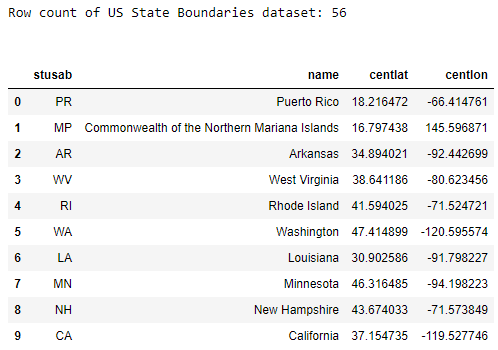

  | No | Column name   | Missing values count | Data type  | Column description |
  | :- | :------------ | :------------------- | :--------- | :----------------- |
  | 1. | stusab        |  0                   | string     | state code |
  | 2. | name          |  0                   | string     | state name |
  | 3. | centlat       |  0                   | double     | latitude |
  | 4. | centlon       |  0                   | double     | longitude |

  __Data cleaning process for US State Boundaries dataset__
  - Remove duplicate rows.  
  - Rename columns:  
    | Original column names | New column names |  
    | -------------------   | ---------------- |
    | stusab | state_code |
    | name | state_name |
    | centlat | latitude |
    | centlon | longitude |

##### __7. ISO 3166-1 Country Codes__

  The dataset preview, count of missing values and the column details of the country codes dataset are shown below. The column description is omitted as the column names are self-explanatory. This dataset will be joined with countries_codes_and_coordinates.csv to provide a country names reference list for mapping each number label in i94cntyl to ISO standard country names as well as country codes.

  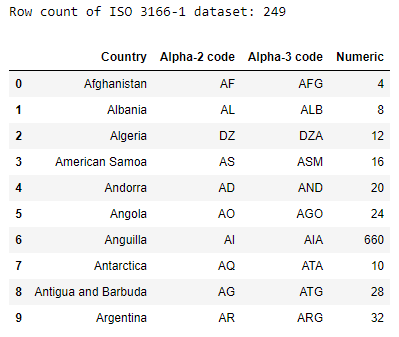  

  | No | Column name    | Missing values count | Data type  |
  | :- | :------------- | :--------- | :--------- |
  | 1. | Country           |  0  | string    |
  | 2. | Alpha-2 code    |  0  | string    |
  | 3. | Alpha-3 code    |  0  |string    |
  | 4. | Numeric            |  0  | integer   |

  __Data cleaning process for ISO 3166-1: Country codes dataset__
  - Column names get formatted in `spark_rw_file` function to meet parquet column naming convention.  
  - Remove `numeric` column.
  - Column names will be renamed as follows:  
    | Original column names | New column names |  
    | -------------------   | ---------------- |
    | country | iban_country |
    | alpha-2_code | iban_iso2 |
    | alpha-3_code | iban_iso3 |

    In `write_countriesnamelist_formercountriesdict` function, the ISO3166-1 Country Codes transformed dataframe will be joined with the transformed ISO 3166-1 Country Codes and Coordinates dataframe, and saved as `iso3166_world` dataframe. The `reference_country` column in `iso3166_world` dataframe will then be converted to a list and saved as text file in `countries_ref_list`.

##### __8. ISO 3166-1 Country Codes and Coordinates__

  The dataset preview, count of missing values and the column details of the country codes and its coordinates dataset are shown below. Some of the country codes has multiple rows with different format of its country name such as BOL for both 'Bolivia' and 'Bolivia, Plurinational State of', and BRN for both 'Brunei' and 'Brunei Darussalam'.

  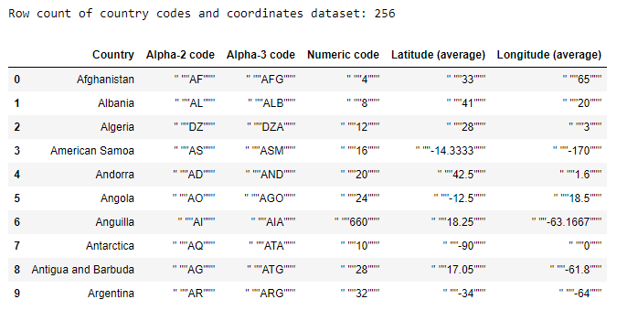

  | No | Column name    | Missing values count | Data type  |
  | :- | :------------- | :--------- | :--------- |
  | 1. | Country           |  0  | string    |
  | 2. | Alpha-2 code    |  0  | string    |
  | 3. | Alpha-3 code    |  0  |string    |
  | 4. | Numeric code          |  0  | string   |
  | 5. | Latitude (average) | 0 | string |
  | 6. | Longitude (average) | 0 |  string |

  __Data cleaning process for ISO 3166-1 country codes and coordinates dataset__
  - Column names get formatted in `spark_rw_file` function to meet parquet column naming convention.  
  - Remove the '"' and _white space_ in columns `alpha-3_code`, `alpha-2_code`, `country`, `latitude_average`, and `longitude_average`.
  - Cast columns `latitude_average` and `longitude_average` to FloatType().
  - Column names will be renamed as follows:  
    | Original column names | New column names |  
    | -------------------   | ---------------- |
    | country | ccc_country |
    | alpha-2_code | ccc_iso2 |
    | alpha-3_code | ccc_iso3 |
    | latitude_average | ccc_lat |
    | longitude_average | ccc_long |

    In `write_countriesnamelist_formercountriesdict` function, the ISO3166-1 Country Codes transformed dataframe will be joined with the transformed ISO 3166-1 Country Codes and Coordinates dataframe, and saved as `iso3166_world` dataframe. The `reference_country` column in `iso3166_world` dataframe will then be converted to a list and saved as text file in `countries_ref_list`.

##### __9. ISO 3166-3 Formerly Used Country Names and New Country Names__

  The preview, count of missing values and the column details of the country codes of formerly used country names dataset are shown below. This dataset will be converted to dictionary and used for looking up new country names for each of the formerly used country names in i94cntyl.

  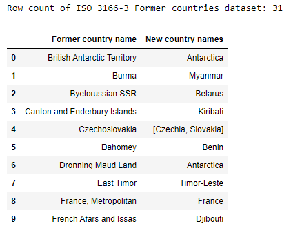

  | No | Column name    | Missing values count | Data type  |
  | :- | :------------- | :--------- | :--------- |
  | 1. | Former country name           |  0  | string    |
  | 2. | New country names    |  0  | string    |

  __Data cleaning process for ISO 3166-3 former country names dataset__
  - Column names get formatted in `spark_rw_file` function to meet parquet column naming convention.

    The transformed ISO 3166-3 former country names dataframe will be converted into a dictionary and saved as a text file in `write_countriesnamelist_formercountriesdict` function.

#### Data Model  
The transformed datasets are organised into the following conceptual data model. The star schema was the chosen data model as the `us_immi` (fact table) contains i94 visitor records which descriptive information of its column labels are kept in other (dimension) tables such as `i94cntyl`, `i94prtl`, `time`, `GlobalLandTemperaturesByCity`, `us-cities-demographics`, and `us-state-boundaries`.    

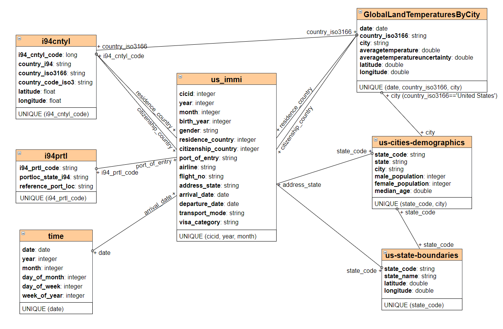  

The details of each tables are as follows:
1. __us_immi__ - I94 US international visitor arrival records in 2016.  

    | Column Names      | Data Types     | Column description |
    | ----------------: | -------------: | ------------------ |
    | cicid   | integer | CIC id |
    | year | integer | arrival year, in 4 digit numerical format
    | month | integer | arrival month, in numerical format
    | birth_year | integer | year of birth in numerical YYYY format.
    | gender |  string | gender, in M, F or X. There is some rows with missing values. |
    | residence_country | integer | country of residence, in numerical label. The label description is stored in table `i94cntyl`. |
    | citizenship_country | integer | country of citizenship, in numerical label. The label description is stored in table `i94cntyl`. |
    | port_of_entry | string | US port of entry, in three-alphanumeric-code label. The label description is stored in table `i94prtl`. |
    | airline | string | code of air carrier boarded to arrive in US. |
    | flight_no | string | flight number on arrival |
    | address_state | string | first intended address (state) while in US. All other code that is invalid is listed under ‘99’. The descriptive information of the US state is stored in `us-cities-demographics` and `us-state-boundaries` tables. |
    | arrival_date | date | arrival date in US, in YYYY-mm-DD formart. |
    | departure_date | date | arrival date in US, in YYYY-mm-DD formart. |  
    | transport_mode | string | mode of transport. Labels are 'Air', 'Sea', 'Land' and 'Not reported'. |
    | visa_category | string | visa code that falls into three categories: 'Business', 'Pleasure', and 'Student'. |  

2. __i94cntyl__ - country information for the numerical country label in _residence_country_ and _citizenship_country_ columns in _us_immi_ table.  
    | Column Names      | Data Types     | Column description |
    | ----------------: | -------------: | ------------------ |
    | i94_cntyl_code | long | numerical label for countries. |
    | country_i94 | string | Original country name description in I94_SAS_Labels_Descriptions |
    | country_iso3166 | string | formatted country name, following ISO 3166-1 country name standard |   
    | country_code_iso3 | string | Country Alpha-3 code |  
    | latitude | float | latitude |
    | longitude | float | longitude |

3. __i94prtl__ - port information for the alphanumeric port codes in _port_of_entry_ column of _us_immi_ table.
    | Column Names      | Data Types     | Column description |
    | ----------------: | -------------: | ------------------ |
    | i94_prtl_code | string | US port of entry, in three-alphanumeric-code label |
    | portloc_state_i94 | string | Original port location description in I94_SAS_Labels_Descriptions |
    | reference_port_loc | string | formatted port location |

4. __time__ - arrival date broken down into specific units, partitioned by _year_ and _month_.
    | Column Names      | Data Types     | Column description |
    | ----------------: | -------------: | ------------------ |
    | date | date | date in YYYY-mm-DD format |
    | year | integer | year of the date, in digit numerical format |
    | month | integer | month of the date |
    | day_of_month | integer | day of month for the date |
    | day_of_week | integer | day of week for date, where 1 - 7 indicates Sunday - Saturday |
    | week_of_year | integer | week of year of given date. A week is considered to start on a Monday and week 1 is the first week with more than 3 days |

5. __GlobalLandTemperaturesByCity__ - monthly average land temperature and coordinates of a city.  
    | Column Names      | Data Types     | Column description |
    | ----------------: | -------------: | ------------------ |
    | date | date | date in date in YYYY-mm-DD format |
    | country_iso3166 | string | formatted country name, following ISO 3166-1 country name standard |
    | city | string | city |
    | averagetemperature | double | average land temperature in Celcius. |
    | averagetemperatureuncertainty | double | the 95% confidence interval of the average temperature |
    | latitude | double | latitude |  
    | longitude | double | longitude |

6. __us-cities-demographics__ - demographics data of US cities in 2015.  
    | Column Names      | Data Types     |
    | ----------------: | -------------: |
    | state_code | string |  
    | state | string |
    | city | string |
    | male_population | integer |
    | female_population | integer |
    | median_age | double |

7. __us-state-boundaries__ - Average latitude and longitude points of each US states.  
    | Column Names      | Data Types     |
    | ----------------: | -------------: |
    | state_code | string |
    | state_name | string |
    | latitude | double |
    | longitude | double |

The flow diagram of the overall ETL process from raw data to transformed datasets shown in the conceptual data model above is provided below. The detailed ETL steps will be discussed in [ETL Pipelines section](#etl) and data cleaning steps of each datasets are provided in [Data Assessment and Data Cleaning section](#data_cleaning).

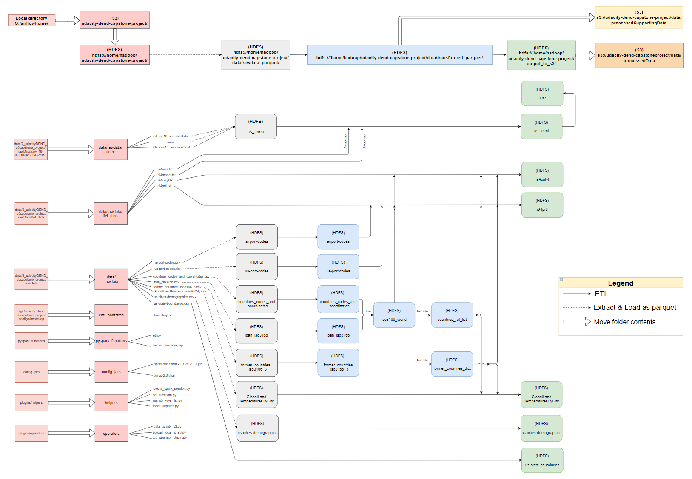

#### ETL Pipelines
The ETL pipelines in this project is shown in the Airflow DAG graph below, with the following order of task dependencies.

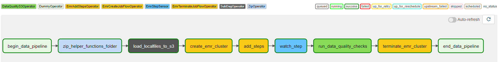

1. Begin data pipeline.  
2. `ZipOperator` compresses the `helper_functions` folder containing helpers functions that will be called in Pyspark ETL process in EMR cluster.   
3. `UploadLocalToS3Operator` moves data files and Python scripts from a directory in local machine to an existing S3 bucket. The DAG and subDAG tree views are shown in the Airflow UI screenshots below.  
  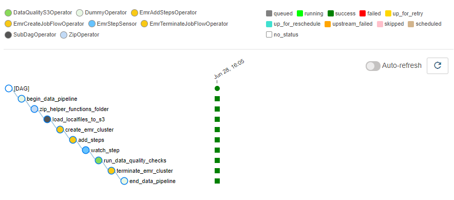  
  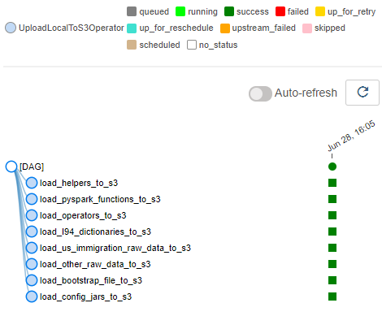  
4. `EmrCreateJobFlowOperator` spins up an EMR cluster using a pre-defined general, software, hardware, and security configurations specified in `job_flow_overrides.json`.  
5. `EmrAddStepsOperator` adds steps listed in `emr_steps.json` to the newly created EMR cluster. The order of EMR steps is:  
      a. Move raw data and Python scripts from S3 bucket to HDFS using the following command:  
      - `s3-dist-cp -Dmapreduce.job.reduces=20 --src=s3://udacity-dend-capstone-project/ --dest=/home/hadoop/udacity-dend-capstone-project`

      b. Move two jars from `config_jars` in S3 to ``/usr/lib/spark/jars/`` in HDFS with the following command:  
      - `sudo aws s3 cp s3://udacity-dend-capstone-project/config_jars /usr/lib/spark/jars/ --recursive`

      c. Execute Pyspark script `etl.py` with spark-submit along with --packages, --jars and --py-files options as of the command below. The data cleaning and transformation process of each dataframes are listed in [Data Assessment and Data Cleaning section](#data_cleaning).    
      - `spark-submit --deploy-mode client --packages com.crealytics:spark-excel_2.11:0.12.2 --jars /usr/lib/spark/jars/parso-2.0.8.jar,/usr/lib/spark/jars/spark-sas7bdat-2.0.0-s_2.11.jar --py-files hdfs:///home/hadoop/udacity-dend-capstone-project/pyspark_functions/helper_functions.zip hdfs:///home/hadoop/udacity-dend-capstone-project/pyspark_functions/etl.py`

      d. Move the transformed main dataframes written into s3_output_folder in HDFS to S3:  
      - `s3-dist-cp --src=hdfs:///home/hadoop/udacity-dend-capstone-project/output_to_s3 --dest=s3a://udacity-dend-capstone-project/data/processedData`

      e. Move the transformed supporting dataframes written into /data/transformed_parquet in HDFS to S3:  
      - `s3-dist-cp --src=hdfs:///home/hadoop/udacity-dend-capstone-project/data/transformed_parquet --dest=s3a://udacity-dend-capstone-project/data/processedSupportingData`

      f. Lastly, delete all raw data files in S3:    
      - `aws s3 rm s3://udacity-dend-capstone-project/data/rawdata --recursive`

6. `EmrStepSensor` watches for the last step to know whether the all steps have been failed or completed successfully.  
7. `DataQualityS3Operator` performs checks against transformed dataframes in parquet files in S3,
whether the dataframe contains any rows and null values in specific columns.  
8. Once the transformed dataframe passed the data quality checks, `EmrTerminateJobFlowOperator` will terminate the EMR cluster.  
9. End of data pipeline.     

#### Discussions
  In this capstone project, automation of data pipeline that includes leveraging Pyspark on EMR cluster to process the I94 US international arrival visitor records, using Apache Airflow, was demonstrated.  

  Each of the I94 sas7bdat files stores monthly visitor records which indicates the I94 data should be updated monthly, along with some of the supporting datasets such as time, global land temperatures and  US cities demographics data. Other supporting datasets that are almost invariable such as port codes, country codes and names, and coordinates, can be updated half-yearly. The monthly and half-yearly updates of the datasets can be automated using Apache Airflow for an efficient and consistent data pipeline.  

  __Discussions on What-Ifs Scenarios__  

  - Data pipeline were to run on a daily basis by 7 am  
    In the scenario where the data update is expected to happen on daily basis by 7 am, the DAG's `schedule_interval` setting can be set at 6.45 am, allowing 15 minutes run time.  The cron time string format ("minute hour DayOfMonth month DayOfWeek") for 6.45 am daily is `"45 6 * * *"`.    

  - Data was increased by 100 times  
    In the case where data was increased by 100 times, the number of partitions used for processing could be increased along with scaling up the EMR cluster with number of cores that matches the number of partition. The balanced number of partitions and cores in EMR cluster minimises the effect of a partition skew and allows better utilisation of EMR cluster.

  - Database needed to be accessed by 100+ people  
    As the transformed data are stored in AWS S3, there is no limit of maximum concurrent connections to an S3 bucket and it automatically scales up to high request rates.  

  Access to transformed datasets for analytics purposes. Example of queries and data visualisations shown in the next section, [Data Analytics and Visualisations](#datavis-analytics).  

#### Data Analytics and Visualisations

The transformed parquet data stored in AWS S3 can be queried to get insight on US international visitor patterns in 2016 such as favourable season or month to visit, their purpose of visit, and favourable US state for certain country's visitor. The examples of data visualisations and query result table are shown below.  

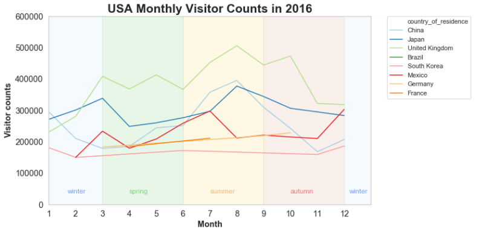

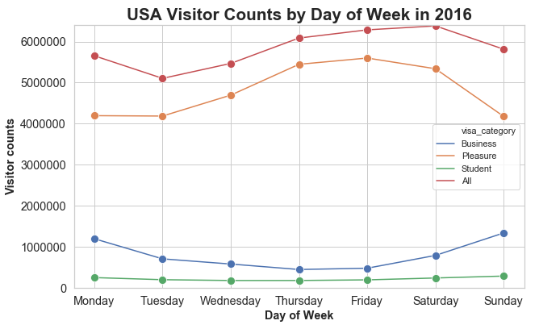

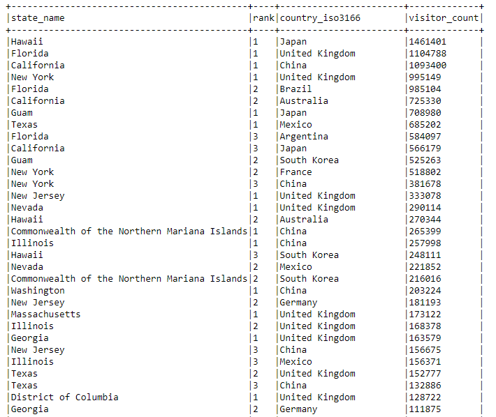
